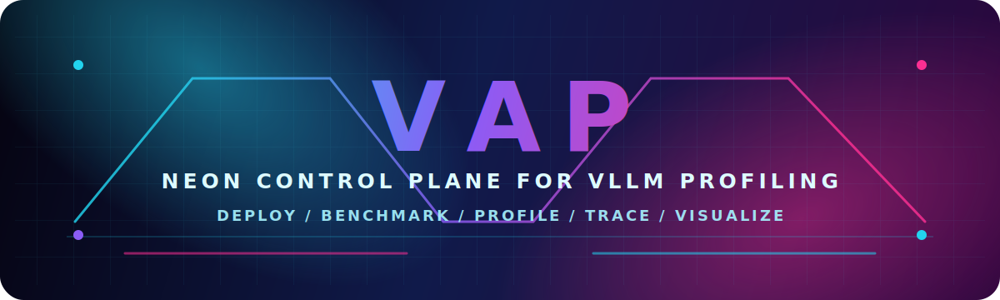

<p align="center">
  
</p>

VAP is a lightweight tool for deploying a vLLM service, running benchmark workloads, collecting profiler output, and viewing run logs through a simple web UI.

The project includes:

- `main.py`: runs the VAP workflow, including vLLM deployment, benchmark execution, profiling, TensorBoard, and Perfetto Trace Processor startup.
- `server.py`: starts a local configuration and control service.
- `public/index.html`: provides the browser UI for editing configs, validating resources, starting/stopping runs, viewing logs, and downloading trace archives.
- `example-config.json`: example configuration template.

## Setup

Install dependencies with the project installer:

```bash
bash install.sh
```

The installer bootstraps `uv` into `bin/` if needed, creates `.venv`, installs VAP in editable mode, downloads `bin/trace_processor`, and warms the local Perfetto executable cache under `bin/perfetto-home/`.

Make sure Docker is available and the configured image, model path, devices, and mounts exist on the host.

## Start the UI

Run the local control server:

```bash
.venv/bin/vap start
```

Open the printed local URL in your browser. The UI lets you:

- edit VAP configuration values;
- validate ports, model paths, Docker image, devices, mounts, and config structure;
- start or stop a VAP run after validation;
- view current run logs;
- open TensorBoard after it starts successfully;
- open Perfetto UI after the trace processor starts on port `9001`;
- download the current run's `vllm-profile` files as a zip archive.

## Run from CLI

You can also run VAP directly with a config file:

```bash
.venv/bin/vap run --config example-config.json
```

Run outputs are written under `logs/`.

To remove generated logs:

```bash
.venv/bin/vap clean
```

## Configuration Notes

The web UI does not overwrite the original config when starting a run. It sends the current form data to the backend, which creates a temporary config file under `tmp/configs/` for that run.

The deploy and benchmark `--host` / `--port` values should stay consistent. The UI keeps these fields synchronized automatically.

`profiler_cfg.tensorboard_port` controls TensorBoard. Perfetto Trace Processor is fixed to local port `9001` so `https://ui.perfetto.dev/` can discover it through the standard local endpoint.

## Generated Files

Runtime logs and temporary config files are generated locally:

- `logs/`
- `tmp/`
- `bin/`

These files are run artifacts and can be deleted when they are no longer needed.
